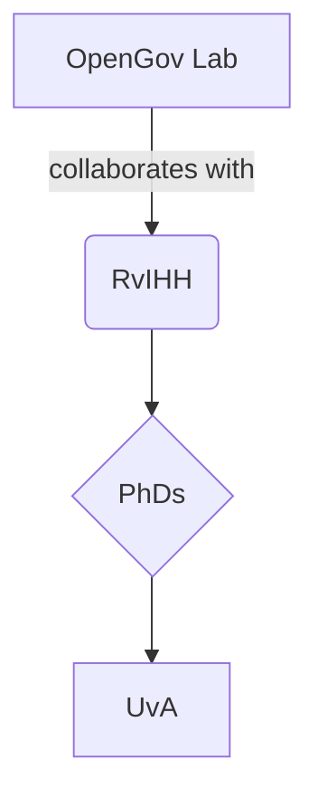

# Demo Post: All MkDocs Material Features

This post demonstrates how to use all special content blocks supported by [MkDocs Material](https://squidfunk.github.io/mkdocs-material/).

<!-- more -->

---

## Admonitions

!!! note "Heads up"
    This is a **note**. Admonitions are great for emphasizing content.

!!! tip
    Tips are useful for suggestions.

!!! warning
    Be careful when using warnings ⚠️

!!! danger
    This is a serious danger block!

---

## Annotations

==Highlighted text== and ==important notes== can be annotated like this.

---

## Buttons

[Click me](https://opengov.nl){ .md-button }

[Secondary](#){ .md-button .md-button--secondary }

---

## Code blocks

Inline `code` looks like this.

````python
def greet(name):
    print(f"Hello, {name}!")
````

---

## Content Tabs

=== "Python"

    ```python
    print("Hello from Python!")
    ```

=== "JavaScript"

    ```js
    console.log("Hello from JS!")
    ```

---

## Data Tables

| Name       | Role            |
|------------|-----------------|
| David      | Assistant Prof. |
| Maarten    | Scientific Lead |
| Jaap       | Director        |

---

## Diagrams



---

## Footnotes

This is a sentence with a footnote.[^1]

[^1]: Here’s the footnote content.

---

## Formatting

- *Italic*
- **Bold**
- `Monospace`
- ~~Strikethrough~~

---

## Grids

<div class="grid cards" markdown>

- :fontawesome-brands-html5: __HTML__ for content and structure
- :fontawesome-brands-js: __JavaScript__ for interactivity
- :fontawesome-brands-css3: __CSS__ for text running out of boxes
- :fontawesome-brands-internet-explorer: __Internet Explorer__ ... huh?

</div>

<div class="grid cards" markdown>

-   :material-clock-fast:{ .lg .middle } __Set up in 5 minutes__

    ---

    Install [`mkdocs-material`](#) with [`pip`](#) and get up
    and running in minutes

    [:octicons-arrow-right-24: Getting started](#)

-   :fontawesome-brands-markdown:{ .lg .middle } __It's just Markdown__

    ---

    Focus on your content and generate a responsive and searchable static site

    [:octicons-arrow-right-24: Reference](#)

-   :material-format-font:{ .lg .middle } __Made to measure__

    ---

    Change the colors, fonts, language, icons, logo and more with a few lines

    [:octicons-arrow-right-24: Customization](#)

-   :material-scale-balance:{ .lg .middle } __Open Source, MIT__

    ---

    Material for MkDocs is licensed under MIT and available on [GitHub]

    [:octicons-arrow-right-24: License](#)

</div>

---

## Icons and Emojis

:material-lightbulb-outline: Idea → Use `:material-...:` to show Material icons.

❤️ 🚀 🧠 — emojis also work!

---

## Images


---

## Lists

### Unordered

- Item 1
- Item 2
  - Nested

### Ordered

1. Step one
2. Step two

---

## Math

Inline math: $E = mc^2$

Block math:

$$
\frac{d}{dx} e^x = e^x
$$

---

## Tooltips

Hover over this <abbr title="Artificial Intelligence">AI</abbr> abbreviation for a tooltip.

You can also use `==annotated text==` or `abbr` directly.

---

Enjoy building rich content in MkDocs Material!
